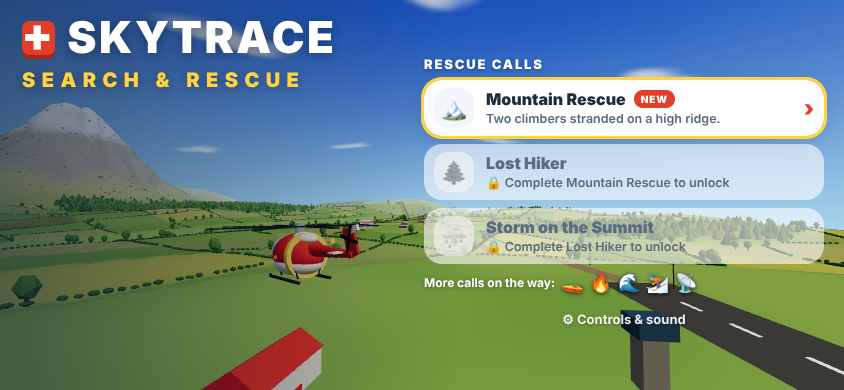
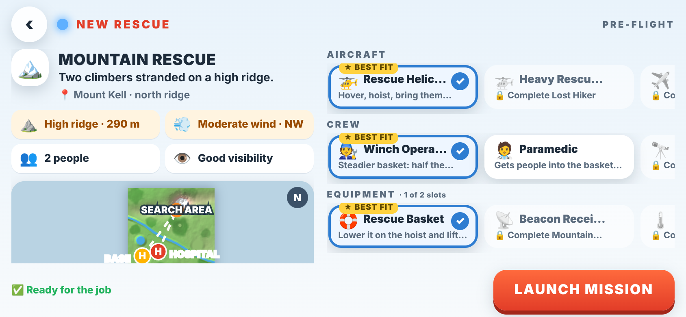
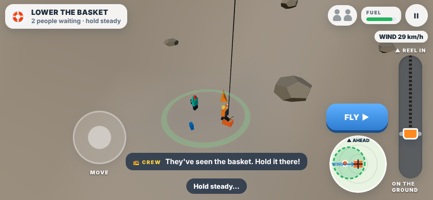
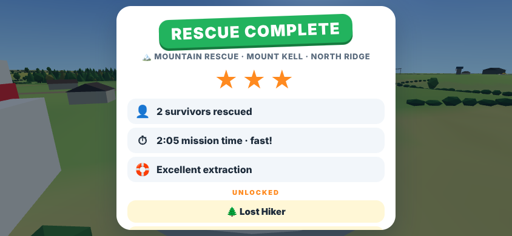
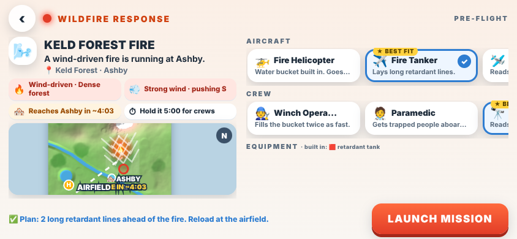
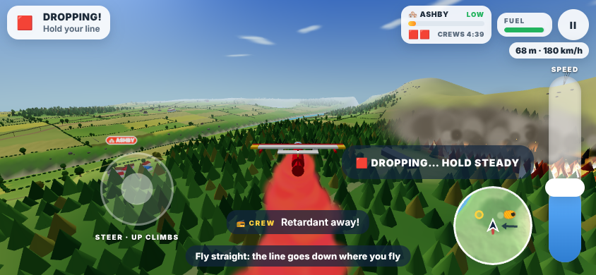
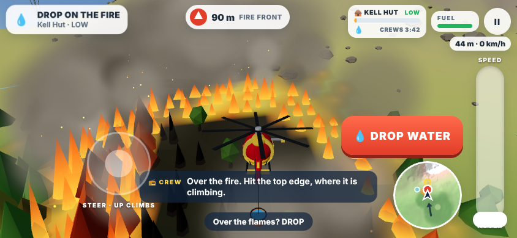
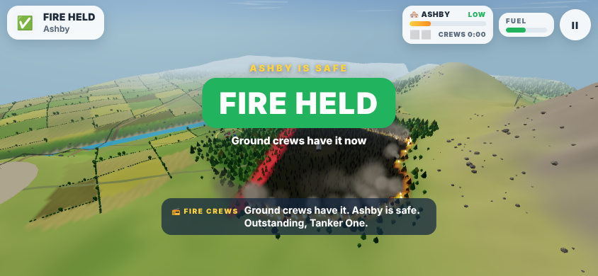

# SKYTRACE · Rescue & Firefighting

Someone needs help. Figure out what they need, choose the right aircraft, fly there, do the job yourself, and see whether your decision changed what happened.

Two families of emergency calls share one valley, one Mission Control and one set of flight controls: **search & rescue** (the hoist) and **wildfire** (a living fire you fight from the air).

**Play it:** https://scottyfncodes.github.io/SKYTRACE/

The flying is the heart. The rescue hoist is the hook. Pre-Flight gives the flying a purpose.

| | |
| --- | --- |
|  |  |
|  |  |

## The loop

**EMERGENCY CALL → PRE-FLIGHT → LAUNCH → FLY → FIND THEM → HOVER & HOIST → FLY THEM HOME → DEBRIEF**

1. **Rescue calls.** The opening screen lists the calls waiting. The first one is open; finishing a rescue opens the next, and new tools with it.
2. **Pre-Flight.** What happened, where, to how many people, in what conditions, and what you send. One screen, readable in a few seconds:
   - **Situation:** one line, a place, and four condition chips (terrain and elevation, wind, people, visibility), plus a map with the base, the search area and the hospital.
   - **Response:** pick an aircraft, one crew member and the equipment. The call's recommended plan is preselected and marked ★ BEST FIT. Pre-Flight says plainly when a plan cannot do the job ("Take the rescue basket: there is nowhere to land") and warns when it will be hard ("Room for 2: 3 people means 2 trips").
   - **LAUNCH MISSION.**
3. **Lift off.** The rotors spin up on the pad and the helicopter lifts itself clear. Then it is yours.
4. **Search.** You know roughly where they are: a blue search area. Get close and they signal (a red flare, or smoke from a campfire). Get closer and you spot them: **SPOTTED!** An orange pin marks them from then on.
5. **The rescue.** Fly over them, slow down, press **HOVER & HOIST**. The camera drops down beside the ledge. The stick now moves the helicopter forward, back and sideways; the lever becomes the winch: slide the basket down. The wind keeps pushing you (the hoist scope shows which way). Land the basket inside the ring and a survivor walks over and climbs in. Lift it too soon and they step back. Reel them in: **SECURED!** Go again for the next one.
6. **Bring them home.** Follow the green beacon to Varrow Hospital and settle onto the H. They walk to the ambulance. If the cabin was full, lift off and go back for the rest.
7. **Debrief.** Who came home, how long it took, how the extraction went, and up to three stars: rescued everyone, under par time, and no bumps (never dropping someone in the basket back onto the ground).

Run out of fuel and the mission fails (TRY AGAIN relaunches it with the same plan).

## Rescues

| Call | Situation | What makes it hard | Opens |
| --- | --- | --- | --- |
| 🏔️ **Mountain Rescue** | Two climbers stranded on the north ridge of Mount Kell | A narrow ledge, a moderate north-westerly | Lost Hiker · Beacon Receiver · Spotter |
| 🌲 **Lost Hiker** | A hiker missing in Keld Forest; one phone ping | A big search area, haze, a clearing ringed by trees | Storm on the Summit · Heavy Rescue Helicopter · Thermal Camera |
| ⛈️ **Storm on the Summit** | Three climbers caught near the summit | Strong gusts, low cloud, three people (two trips in the light helicopter) | |

Capsized Boat, Flood Rescue, Injured Skier and Distress Beacon are defined as data and wait for their vehicles and kit (the Rescue Boat, the Search Aircraft, the rescue swimmer).

## Wildfire

A wildfire call is not another precision drop. The fire is a living thing on the map: it has a front, hotspots and smoke, the wind drives it, it runs uphill, forest burns hot and meadow slowly, and water and bare rock stop it. Strong wind throws embers ahead of it (spot fires). The question is never "can you hit the circle", it is **where** and **when** to put what you carry, and **which aircraft** to send.

**PLAN → DEPLOY → OBSERVE → ADAPT**

| | |
| --- | --- |
|  |  |
|  |  |

1. **Mission Control.** The map shows the fire, chevrons sweeping the way it is spreading, a ghost of where it will have burned in two minutes if nobody goes, each place in danger with *FIRE IN ~4:10*, and where the water is. Chips: the kind of fire, the wind and which way it pushes, how soon it reaches a town, and how long you must hold it for the ground crews. Pick an aircraft; Pre-Flight says how it will fight this fire ("Plan: 2 long retardant lines ahead of the fire") and warns when it is the wrong tool ("A front this wide outruns one bucket at a time").
2. **Fly out.** The fire panel shows the place in danger, a threat bar (LOW → CRITICAL), what you have left, and the countdown to the crews.
3. **Fight it.** Before you press DROP, the ground shows where it will land (a red strip for a line, a blue ring for a bucket). Tolerances are generous; the decision is what matters.
4. **Watch it.** The front runs into your line and stops (THE LINE IS HOLDING!), or flanks round its end, or embers jump. Adapt: another line, reload, refill.
5. **Consequence.** Hold it until the crews arrive (or cut it off from everything it threatens: CONTAINED). The camera circles the fire; the debrief shows the fire **without you** next to the fire **with you**, how much forest burned against how much would have, and up to three stars (job done, forest saved, fire kept well away). Let it reach a town and the mission fails.

| Aircraft | How it fights fire | The decision it creates |
| --- | --- | --- |
| ✈️ **Fire Tanker** | DROP lays a 230 m retardant line along the path you fly. 2 lines a load; reload low over the airfield | Where to lay the line ahead of the front, and anchoring both ends |
| 🚁 **Fire Helicopter** | A bucket on a long line. DROP lets it go just ahead of you (knocks hotspots out); refill by hovering low over the river or a dip tank | Which hotspot first; the round trip to the water |
| 🛩️ **Fire Spotter** | Fast; reads the fire (shows where it will be in a minute). MARK flies a line, and Tanker 42 drops a 320 m line along it 14 s later. 3 calls | Leading the fire: the drop comes after you mark it |

Any rescue helicopter can carry the **Water Bucket**; the Spotter crew member (Ari) also reads the fire, and the Winch Operator fills the bucket twice as fast.

| Call | Kind | What makes it hard | Recommended |
| --- | --- | --- | --- |
| 🔥 **Lightning Strike** | Small fire | Quick: one helicopter can put it out before it reaches the campsite | Fire Helicopter |
| 🌬️ **Keld Forest Fire** | Wind-driven | A strong wind runs it at Ashby; one line is not enough | Fire Tanker |
| ⛰️ **Mountain Fire** | Uphill | It climbs Mount Kell at the hut; steep ground keeps a tanker high | Fire Helicopter |
| ⚡ **Dry Lightning** | 3 hotspots | Three fires, three places, three calls: which first? | Fire Spotter |
| 🆘 **Trapped by Fire** | Fire + rescue | Two hikers in the clearing as the fire closes in: slow it with water, or race it with the hoist | Fire Helicopter + basket |

Lightning Strike and Keld Forest Fire are open from the start, with the Fire Helicopter and the Fire Tanker. Keld Forest Fire opens Mountain Fire, Dry Lightning and the Fire Spotter; Lightning Strike opens Trapped by Fire.

## The fleet

Tools, not stat sheets: each one has an obvious job.

| | Strengths | |
| --- | --- | --- |
| 🚁 **Rescue Helicopter** | Hovers · Rescue hoist · Nimble · seats 2 | From the start |
| 🚁 **Heavy Rescue Helicopter** | Carries 4 · Steady in wind (half the drift) · 3 equipment slots · slower | After Lost Hiker |
| 🚁 **Fire Helicopter** | Water bucket built in · Very nimble · Seats 2 | From the start |
| ✈️ **Fire Tanker** | Long retardant lines · Big loads · Wide turns | From the start |
| 🛩️ **Fire Spotter** | Fast · Sees the spread · Calls 3 tanker drops | After Keld Forest Fire |
| ✈️ Search Aircraft | Fast · Long range · Finds beacons | Coming |
| 🚤 Rescue Boat | Water rescue · Tows boats · Carries 6 | Coming |

**Crew** (one seat): the Winch Operator steadies the basket (half the swing), the Paramedic gets people into the basket twice as fast, the Spotter sees people from much further away.

**Equipment:** the Rescue Basket (the hoist: required for every rescue so far), the Beacon Receiver (the arrow points at the survivor's phone while you search), the Thermal Camera (spots people from twice as far, even in cloud).

## Controls

| | Touch (iPhone) | Keyboard |
| --- | --- | --- |
| Steer (bank) and climb / descend | Drag on the steering side | Arrows / WASD |
| Speed (bottom: hover) | Lever on the other side | Shift / Q faster, Ctrl / Z slower |
| Hover & hoist / fly on | The orange button over the people | Space, Enter or H |
| Drop retardant / water, mark a line | The red DROP button (over a fire) | F or X (Space too, on a fire with nobody trapped) |
| In a hover: hold position | Drag (up is always forward) | Arrows / WASD |
| In a hover: the winch | The lever is the basket: slide it down to lower, up to reel in | Ctrl / Z lower, Shift / Q reel in |
| Pause | II | Esc / P |

In the pause menu: **Climb** (stick up or stick down climbs), **Steer with** (left or right thumb; the lever, minimap and buttons move to the other side), sound, and the radio voice (the device's speech voice reads the radio; subtitles are always on). Preferences and progress are saved in the browser.

## Development

```
npm install
npm run dev        # local dev server
npm run typecheck  # tsc --noEmit
npm test           # vitest
npm run build      # production build into dist/
npm run check      # typecheck + test + build
```

Pushes to `main` build and deploy to GitHub Pages via `.github/workflows/deploy.yml`.

## Architecture

Plain TypeScript + Vite + Three.js, no backend. The rules are pure, data-driven and tested; the game wires them to the scene and the screens.

| Module | Role |
| --- | --- |
| `src/flight/aircraft.ts` | The arcade flight model (pure, tested). Unchanged for aeroplanes; a `climbRate` in the profile flies it as a helicopter with the same stick and lever |
| `src/flight/camera.ts` | Chase camera; drops down beside the people in the hoist view |
| `src/flight/helicopterMesh.ts` | The Rescue and Heavy Rescue helicopters: spinning rotors, lights, the hoist arm and its winch point |
| `src/rescue/catalog.ts` | Vehicles, crew and equipment as data, with the capabilities each grants |
| `src/rescue/missions.ts` | Emergency calls as data: situation, conditions, site, search area, signal, requirements, recommended plan, radio, unlocks; a `fire` block makes it a wildfire (area, ignitions, threatened places, spread, embers, head start, hold time, water, advice) |
| `src/rescue/loadout.ts` | The Pre-Flight plan: choices, checks (blocking and warnings), and the `Plan` it gives the flight (pure, tested) |
| `src/rescue/run.ts` | One mission as a state machine: takeoff → search → rescue → return → complete or failed; on a fire, takeoff → attack → complete (the fire runs alongside the rescue when people are trapped); objectives; when you can hoist and land (pure, tested) |
| `src/rescue/hoist.ts` | The basket on its cable (a pendulum under the winch, pushed by the wind, dragged when taut) and the survivors walking to it and climbing in (pure, tested) |
| `src/rescue/hover.ts` | Station-keeping in the hover: stick moves, altitude holds, the wind pushes (pure, tested) |
| `src/rescue/wind.ts` | Wind with gusts, deterministic in time (pure, tested) |
| `src/fire/fireSim.ts` | The wildfire: a grid of cells over the terrain with fuel (forest, meadow, none), wind and slope driven spread, burn-out, embers, retardant and water, and the containment question "can it still reach this place?" as a flood fill (pure, deterministic, tested) |
| `src/fire/fireRun.ts` | Fighting it as part of a run: loads, drops, the tanker's line along your path, the bucket, scooping and reloading, the spotter's marks and Tanker 42, the threat level, held / contained / breached, and the fire nobody fought for the debrief (pure, tested) |
| `src/rescue/progress.ts` | Completed rescues, stars, best times, last plan; unlocks derived from `unlockedBy` (pure, tested) |
| `src/rescue/debrief.ts` | Three lines and up to three stars (pure, tested) |
| `src/game/RescueGame.ts` | Orchestration: screens, launch, flight, hover and hoist, landing, debrief, radio and sound cues |
| `src/ui/` | Title (rescue calls), Pre-Flight, HUD (objective, nav arrow, people, fuel, radio, lever / winch, minimap and hoist scope), valley map |
| `src/world/fireScene.ts` | The fire made visible: the burn map draped on the terrain (front, ash, retardant, wet ground, heating ahead of the flames), flames, a fire light, smoke and embers, trees that scorch and char, the places in danger and the water, retardant and water drops, the drop preview, Tanker 42 |
| `src/flight/planeMesh.ts` | The Fire Tanker and the Fire Spotter |
| `src/world/` | The valley (terrain with Mount Kell and its ledges, forests, farmland, village), the helipads, hospital and ambulance, the people, the basket, signals and markers |
| `src/core/` | Input (touch stick, lever, keyboard), settings, the synthesised soundscape (rotor, winch, chimes), the radio |

**Adding a rescue or a fire** of an existing kind is a new entry in `MISSIONS` (a fire is a `fire` block: where it starts, what it threatens, how fast it spreads). **A new vehicle** is an entry in `VEHICLES` (and a mesh if it flies something new). **New equipment** is an entry in `EQUIPMENT` with the capability it grants; a new capability (water, fire) needs the mechanic it unlocks.

Automated checks live in `tests/` (`tests/fire.test.ts`: the fire's behaviour, the drops and loads, Mission Control's choices, and every wildfire call won with a sensible plan and lost when ignored). A Playwright bot flew the Mountain Rescue end to end through the real keyboard controls at iPhone landscape and portrait sizes for QA.
